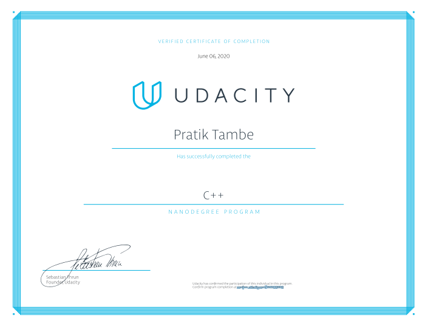

# Udacity_C++_Nano_Degree_Projects

1 - **Route Planner:** Use OpenStreetMap data and the IO2D visualization library to build a route planner that finds a path between two points on a real-world map.

2 - **Process Monitor:** Write object-oriented C++ to build a Linux system monitor similar to the widely used htop application.

3 - **Memory Management Chatbot:** Optimize existing chatbot code using modern C++ memory management techniques such as smart pointers and move semantics.

4 - **Concurrent Traffic Simulation:** Build a multithreaded traffic simulator using a real urban map. Run each vehicle on a separate thread, and manage intersections to facilitate traffic flow and avoid collisions.

5 - **Capstone Project:** Snake Game - Final capstone project for the program.

## Udacity C++ Nano Degree Certificate

